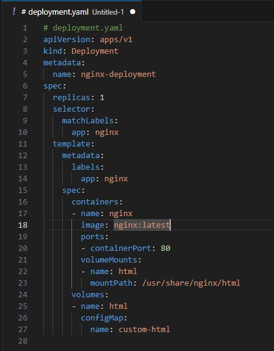
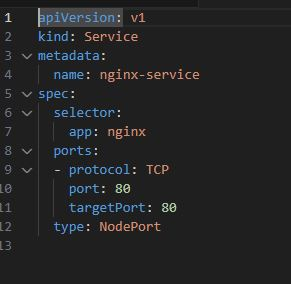
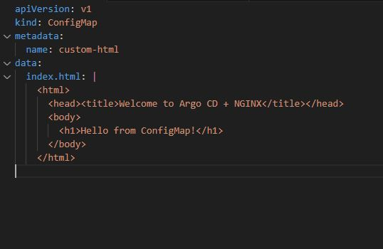
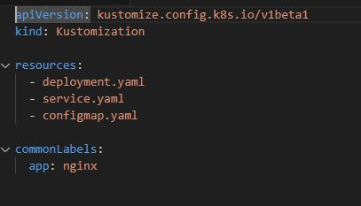
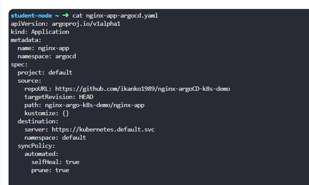
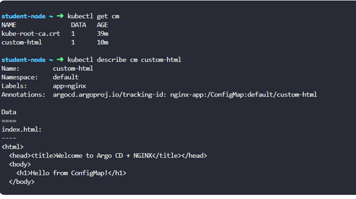
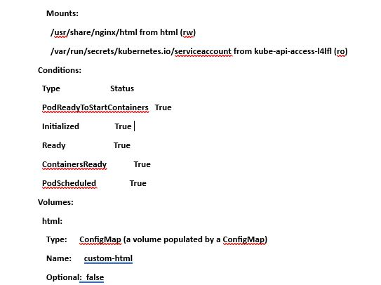
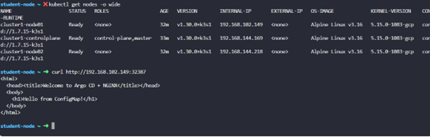

#  Project: `nginx-argoCD-k8s-demo`

## 🎯 Objectives

Deploying an **NGINX web server** with custom HTML via a ConfigMap, using **Kustomize** and **Argo CD** on a Kubernetes cluster.

This includes:
- ✅ Full GitHub-based GitOps flow  
- ✅ Kustomize folder structure and usage  
- ✅ Argo CD setup and deployment  
- ✅ Testing the app  

## ⚙️ How It Works

1. **Kubernetes Cluster**  
   A running Kubernetes cluster must be deployed before starting.

2. **GitOps with Argo CD**  
   Argo CD continuously watches your GitHub repository for changes to Kubernetes manifests and syncs them automatically.

3. **Kustomize Structure**  
   Manifests like Deployment, Service, and ConfigMap are managed using Kustomize’s modular file structure.

4. **ConfigMap Injection**  
   A custom `index.html` file is stored inside a ConfigMap and mounted into the NGINX pod at runtime.

5. **Automated Deployment**  
   Argo CD applies the manifests, deploys the NGINX pod, mounts the ConfigMap, and exposes the service using NodePort.

6. **Live App Access**  
   The NGINX app becomes accessible at `http://<NodeIP>:<NodePort>`, displaying the custom HTML page.


---

## 🧱 1. Components

| Component         | Description                                                  |
|------------------|--------------------------------------------------------------|
| NGINX Deployment | A simple NGINX pod serving static HTML content               |
| ConfigMap        | Contains a custom `index.html` file                          |
| Kustomize        | Manages the deployment using modular YAML files              |
| Argo CD          | Watches a GitHub repo and syncs the manifests automatically  |
| GitHub           | Stores your Kustomize-based Kubernetes manifests             |

---

## 📁 2. Directory & File Structure  
nginx-argo-k8s-demo/  
└── nginx-app/  
├── deployment.yaml  
├── service.yaml  
├── configmap.yaml  
└── kustomization.yaml  

## 📄 3. Manifest Files

### `deployment.yaml`
  
### `service.yaml`
  
### `configmap.yaml`
  
### `kustomization.yaml`
   

## 🚀 4. Push Code to GitHub  
```bash
git init
git remote add origin https://github.com/ikanko1989/nginx-argo-k8s-demo.git
git add .
git commit -m "Initial commit: NGINX with Kustomize and argoCD"
git push -u origin master
```
## ☸️ 5. Use Kubernetes for Argo CD Deployment  

**a. Create Argo CD namespace:**  
student-node ~ ➜  kubectl create ns argocd  

**b. Install Argo CD:**    
student-node ~ ➜  kubectl apply -n argocd -f https://raw.githubusercontent.com/argoproj/argo-cd/stable/manifests/install.yaml  

## 🌐 6. Access Argo CD
**a. Port-forward Argo CD server:**  
“Wiith this we are forwarding my local machine’s port 8080 to the Argo CD service's port 80 inside the cluster.”   
student-node ~ ➜  kubectl port-forward svc/argocd-server -n argocd 8080:80  
student-node ~ ➜  curl -k http://localhost:8080  
 
**b. Get the initial password:** 
(needed in case we want use UI)  

student-node ~ ✖ kubectl -n argocd get secret argocd-initial-admin-secret -o jsonpath="{.data.password}" | base64 -d  
BJxI5r4EAhazT--l  


## 🔁 7. Create Argo CD Application

You can create the Argo CD app using a declarative YAML file or using UI.
I have used YAML:  



**Apply the Argo CD Application:**

student-node ~ ➜  kubectl apply -f nginx-app-argocd.yaml   
application.argoproj.io/nginx-app created  

## ✅ 8. Confirm Deployment

Check if everything is running:  

student-node ~ ➜  kubectl get pods -o wide  
NAME                                READY   STATUS    RESTARTS   AGE   IP          NODE              NOMINATED NODE   READINESS GATES  
nginx-deployment-5f9f5cfd55-llbtp   1/1     Running   0          11m   10.42.1.6   cluster1-node01   <none>           <none>    

Config map created and mounted in pod(config applied to pod):  


student-node ~ ➜  kubectl describe pod nginx-deployment-5f9f5cfd55-llbtp   
....  


Look for nginx-service and its NodePort.  

## 🌍 9. Access the NGINX App

**Get the NodePort:**

student-node ~ ➜  kubectl get svc nginx-service  
default       service/nginx-service    NodePort       10.43.106.141   <none>    80:32387/TCP   6m23s


**Access the app via curl:**




**Or open in your browser:**

http://192.168.102.149:32387
